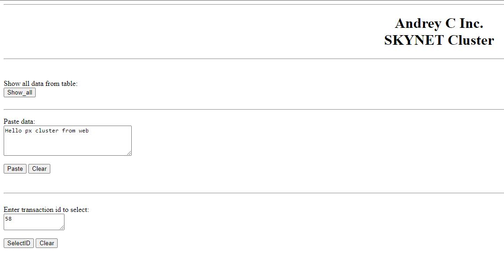
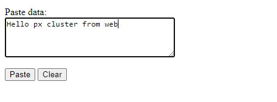
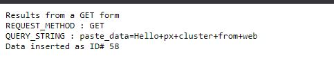
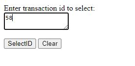
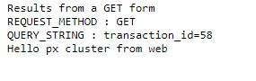
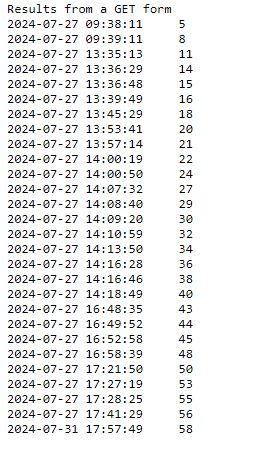

### Выполнение задания по занятию № 10 MySQL - кластер
## Задание
Перевести базу веб-проекта на один из вариантов кластера MySQL: Percona XtraDB Cluster или InnoDB Cluster.  

Описание/Пошаговая инструкция выполнения домашнего задания:  
Разворачиваем отказоустойчивый кластер MySQL (PXC || Innodb) на ВМ или в докере любым способом  
Создаем внутри кластера вашу БД для проекта  

### Описание выполнения
Задача выполнена на ОС  Almalinux 9.x под веб приложение и Ubuntu 22.04.4(jammy) под кластер базы данных.
Для развертывания стенда применяется vagrant.  
Развертывание стенда выполняется командой  
```vagrant up```  
в результате чего будет готов стенд c 4-я виртуальными серверами 
- pxc1 
- pxc2 
- pxc3
- web

Развертывания ПО и конфигурирование серверов осуществляется средствами ПО ansible с web сервера. После выполнения 
ролей ансибл будет настроен кластер MySQL Percona XtraDB на серверах pxc1, pxc2, pxc3, на сервере web
разварачивается web сервер и proxysql.  

При необходимости можно переопределить переменную для изменения сетевого интерфейса по которому будет доступна,
веб страница в файле ansible/roles/nginx/templates/site.conf.j2, по умолчанию занчение 
**{{ ansible_eth1.ipv4.address }}**. То есть интерфейс eth1 виртуального сервера, смотрящий в локальную сеть.

Для запуска ролей ansible необходимо выполнить следующие действия:  
- подключиться к серверу web   
`vagrant ssh web`
- запустить ansible playbook
```commandline
cd ansible
ansible-playbook playbooks/deploy.yml
```
### Итог
Проверяем статус кластера:  
в консоли веб сервера выполняем команду для подключения к СУБД  
`mysql -u sbuser -p'Pa$$w0rd' -h 127.0.0.1 -P 6033`  
`mysql>show status like 'wsrep%';`  
В выводе должны увидеть следующие строки
```commandline
| wsrep_cluster_conf_id            | 3                                                                                                                                              |
| wsrep_cluster_size               | 3
```
Видим 3-х узловой кластер.  
Простое веб приложение будет доступно по ссылке  
`http://<ip_address>/cgi-bin/db_app.cgi`  


В поле "Paste data" можно ввести текст и нажать кнопку paste. Информация будет записана в БД.  

  
  
Запись добавлена в БД с ID 58.  
Получим данную запись из БД  
  
  
Выведем все ID в БД с помощью кнопки  Show_all  

