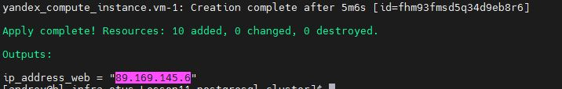
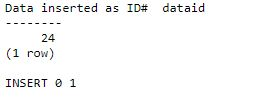
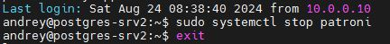
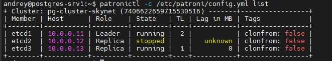
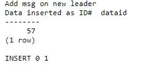

## Выполнение задания по занятию № 11 PostgreSQL cluster
### Задание
реализация кластера postgreSQL с помощью patroni

Цель:
Перевести БД веб проекта на кластер postgreSQL с ипользованием patroni, etcd/consul/zookeeper и haproxy/pgbouncer

Описание/Пошаговая инструкция выполнения домашнего задания:
Перевести БД веб проекта на кластер postgreSQL с ипользованием patroni, etcd/consul/zookeeper и haproxy/pgbouncer.

### Описание выполнения
Задача выполнена на ОС  Almalinux 9.x под веб приложение и debian12 под кластер базы данных postgresql.
Стенд развертывается при помощи terraform в yandex cloud.  
Развертывание стенда выполняется командой  
```terraform apply```  
При развертывании стенда автоматически будут запущены роли ансибл, которые установят и настроят необходимое ПО. 
в результате чего будет готов стенд c 4-я виртуальными серверами 
- postgres-srv1 
- postgres-srv2
- postgres-srv3
- web

На серверах postgres-srv{1..3} устанавливается postgresql15-server, etcd-server и patroni, на web сервер устанавливается
nginx, haproxy, postgresql15-client.  

По заврешении выполнения комнады будет выведен ip адрес веб сервера  
  
Этот адрес требуется для доступа к веб приложению  
<IP_WEB>/cgi-bin/db_app.cgi  
Состаяние кластера серверов БД можно посмотреть с любого сервера БД, командой  
`patronictl -c /etc/patroni/config.yml list`  
Для работающего кластера должен быть следующий вывод
```commandline
+ Cluster: pg-cluster-skynet (7406622659715530516) ---------+-----------------+
| Member | Host      | Role    | State     | TL | Lag in MB | Tags            |
+--------+-----------+---------+-----------+----+-----------+-----------------+
| etcd1  | 10.0.0.11 | Replica | streaming |  1 |         0 | clonfrom: false |
| etcd2  | 10.0.0.12 | Leader  | running   |  1 |           | clonfrom: false |
| etcd3  | 10.0.0.13 | Replica | streaming |  1 |         0 | clonfrom: false |
+--------+-----------+---------+-----------+----+-----------+-----------------+
```
haproxy настроен так, что задачи записи направляются на Leader, а задачи чтения на реплики (Replica). 

### Проверки работоспособности
Добавление записи:  
  
  
Запись добавлена с ID 24  
Получение записи из БД:  
  
  
Отказоустойчивость кластера БД: Останавливаем лидер ноду  

Новый лидер:  
   
Проверка работы приложения:  
   
  
Видим, что добавлась запись с ID 57.

### Команды для работы с ETCD
```commandline
etcdctl member list
etcdctl member list | grep -o '[^ ]\+:2379' | paste -s -d,
etcdctl endpoint status --endpoints=$ENDPOINTS -w table
etcdctl endpoint status --cluster -w table
sudo etcdctl endpoint health --cluster -w table
ETCDCTL_API=2 etcdctl ls --recursive --sort -p /db/pg-cluster
export ETCDCTL_API=3
```
