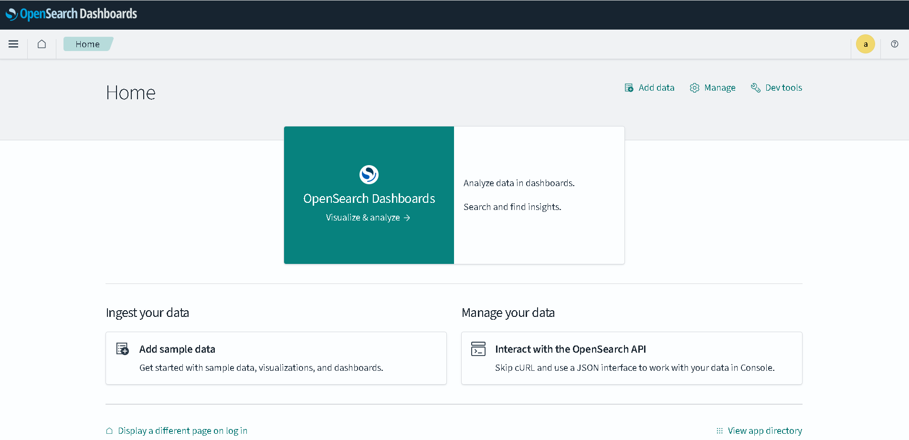
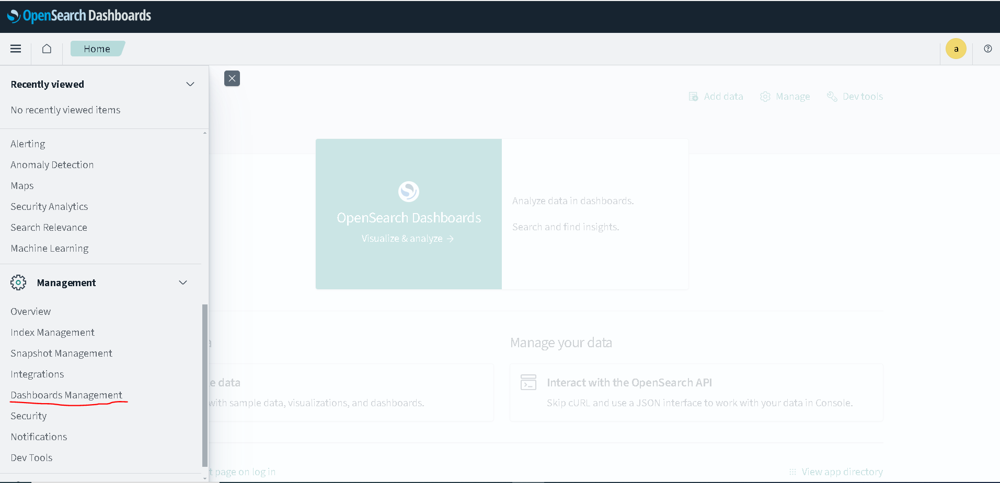
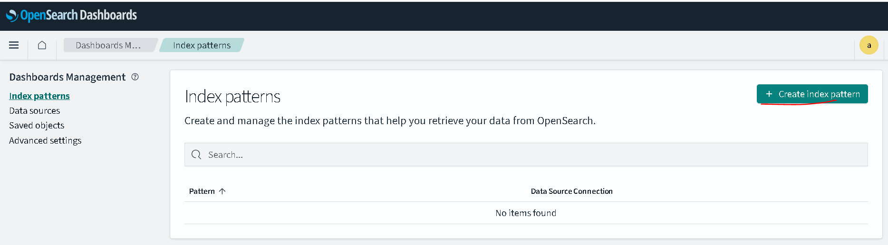
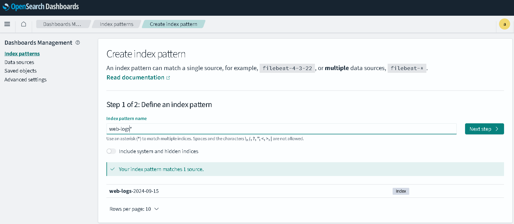
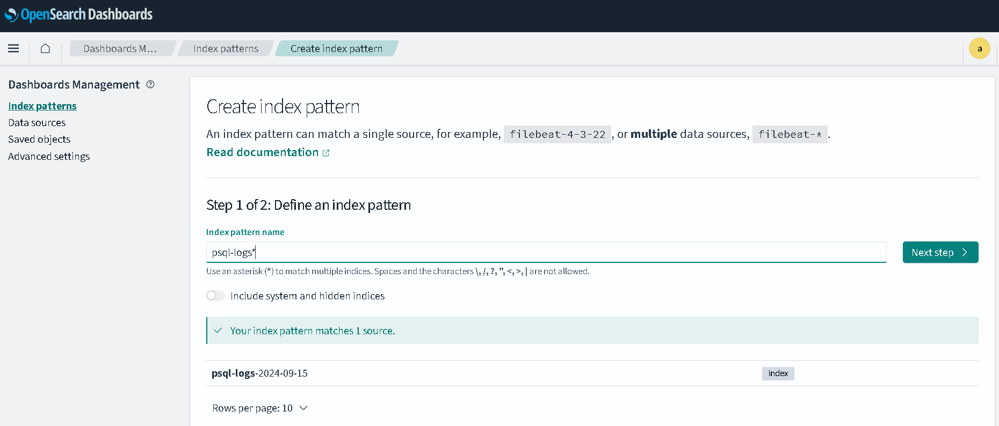
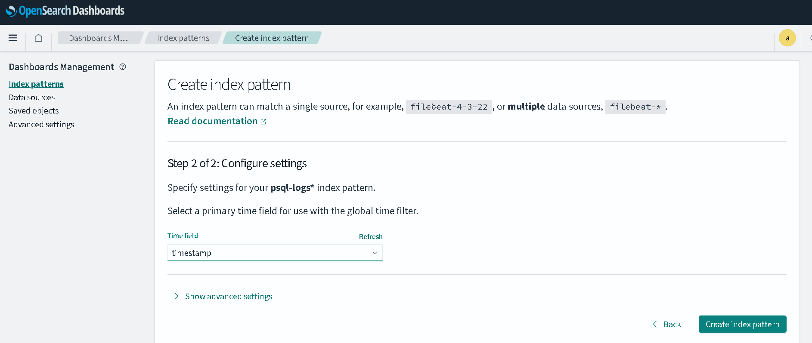
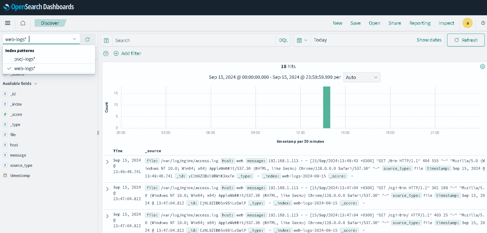
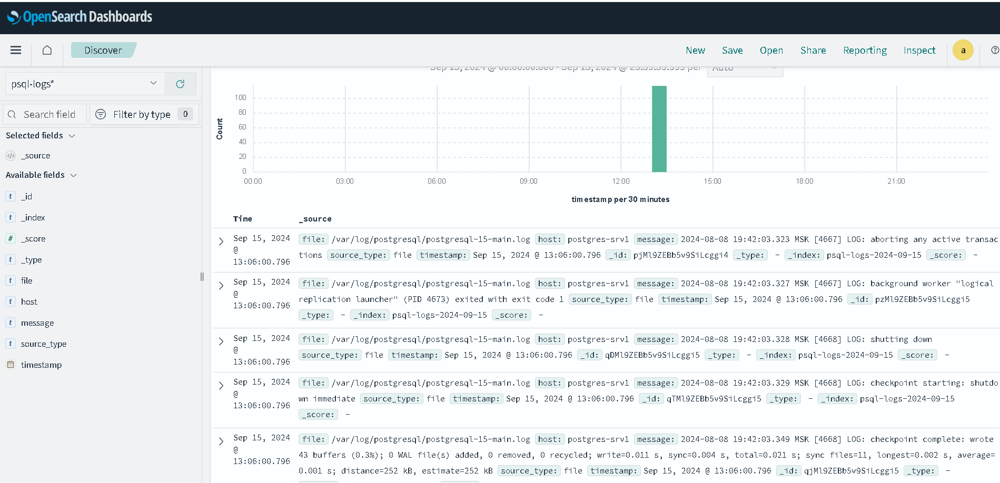

## Выполнение задания по занятию № 13 Elasticsearch
### Задание
Настроить централизорованный сбор логов в кластер elasticsearch

Цель:  
1. Развернуть кластер elasticsearch (минимум 3 вм)  
2. Настроить сбор логов со всех серверов проекта (веб-сервера, балансеры, базы данных)

### Описание выполнения
Задача выполнена на ОС  Almalinux 9.x под веб приложение и debian12 под кластер базы данных postgresql   
и кластер elasticsearch для централизованного сбора логов.  
Стенд развертывается при помощи terraform в yandex cloud.  
Развертывание стенда выполняется командой  
```terraform apply```  
При развертывании стенда автоматически будут запущены роли ансибл, которые установят и настроят необходимое ПО. 
в результате чего будет готов стенд c 7-ю виртуальными серверами 
- postgres-srv1 
- postgres-srv2
- postgres-srv3
- web  
- osearch1
- osearch2
- osearch3

На серверах postgres-srv{1..3} устанавливается postgresql15-server, etcd-server и patroni, на web сервер устанавливается
nginx, haproxy, postgresql15-client. На все сервера устанавливается ПО vector (https://vector.dev/), которое собирает   
логи и отправляет их в кластер opensearch для централизованного хранения.  
В данном примере с web севреа для статического хранения файлов сайта будут собираться логи nginx,   
а с серверов хранения баз данных - логи pstgresql.
Для установки OpenSearch и OpenSearch Dashboard был склонирован репозиторий  
https://github.com/opensearch-project/ansible-playbook с внесением некотрых изменений для работы в собственном рабочем   
окружении.

По заврешении развертывания стеднда будут выведены значения переменных для  
доступа к веб приложению и веб интерфейсу opensearch dashboard.
```commandline
ip_address_opensearch
ip_address_web
```
 Для доступа к веб приложению необходимо использовать ссылку  
`<ip_address_web>/cgi-bin/db_app.cgi`  
Для доступа к веб интерфейсу opensearch dashboard  
`<ip_address_opensearch>:5601`

### Проверки работоспособности
Интерфейс opensearch dashboard  
  
Переходим в главное меню -> Dashbords Management
  
Кликаем по кнопке "Create index pattern":
   
В поле "Index pattern name" вводим "web-log-*" и кликаем по кнопке "Next step":  

На следующем шаге из списка "Time field" выбираем "@timestamp".  
Таким же образом настроаивем логи серверов postgresql:
  
   
Переходим по кнопке "Главное меню" и выбираем "Discover":  
  

Видим поступление логов от веб сервера и серверов кластера postgresql.