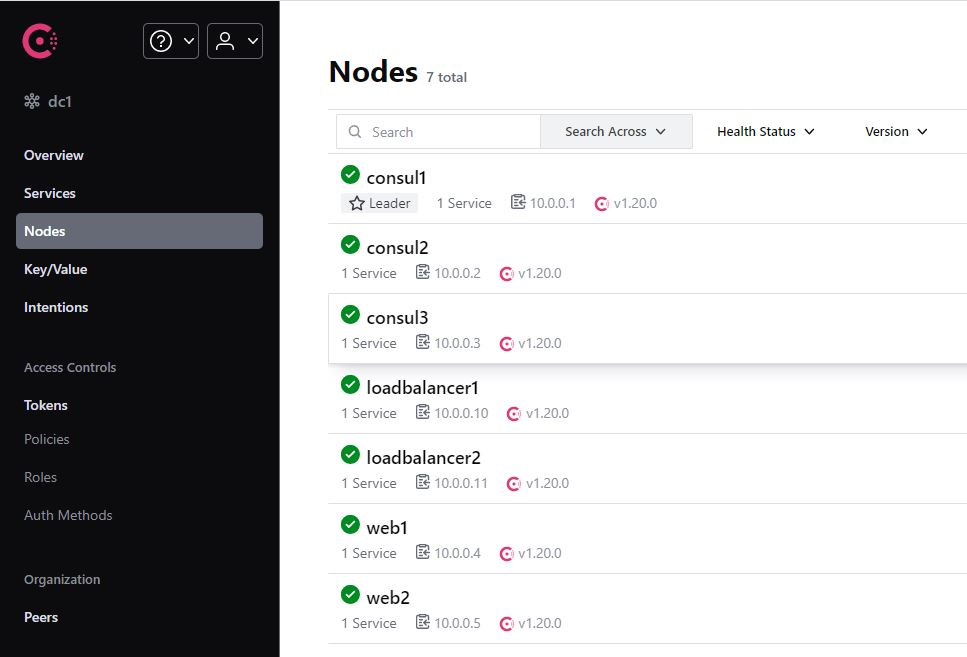

## Выполнение задания по занятию № 16 CONSUL
### Задание
Consul cluster для service discovery и DNS

Цель:
Реализовать consul cluster который выдает доменное имя для веб портала с прошлой ДЗ.  
Плавающий IP заменить на балансировку через DNS.  
В случае умирание одного из веб серверов IP должен убираться из DNS.  

### Описание выполнения
Стенд для выполнения задания состоит из 6 серверов: 
- loadbalancer 
- web1
- web2
- consul1  
- consul2
- consul3

На сервере loadbalancer устанавлен consul, consul-template, nginx для балансировки трафика на web1 и web2.   
На сервера web1 и web2 установлен consul, nginx для работы веб сервера. На consul1, consul2, consul3  
образуют кластер consul.  
### Проверки работоспособности
Список серверов в GUI consul:
  

Список сервисов в GUI consul:
 

Проверка доступности бэкэндов с балансировщика:  
  

Отключаем nginx на сервере web2, видим в GUI, что сервер не доступен:  
  

Проверяем доступность бэкэнда, видно, что отвечает только web1. За счет consul-template не рабочая нода была удалена  
из конфигурации nginx:  
  
