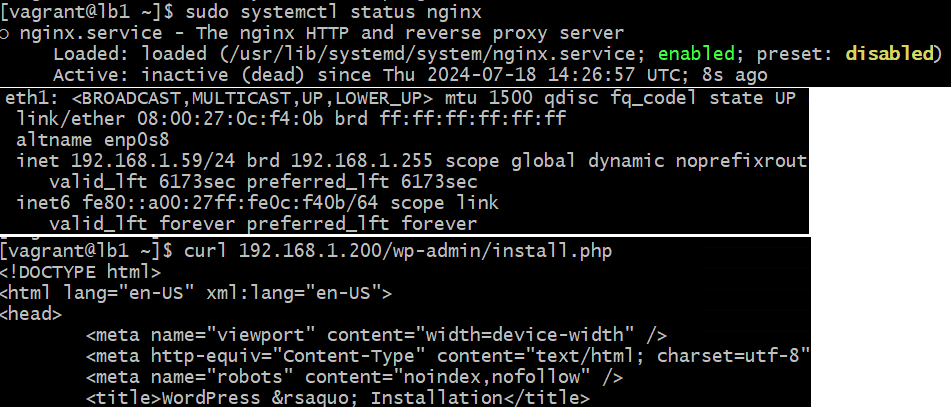
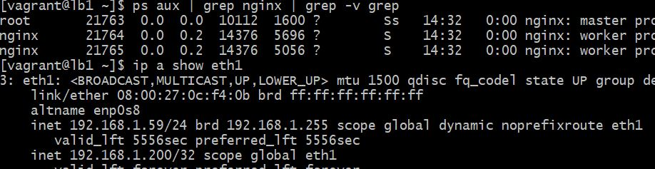
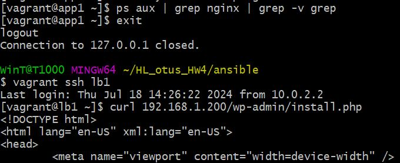
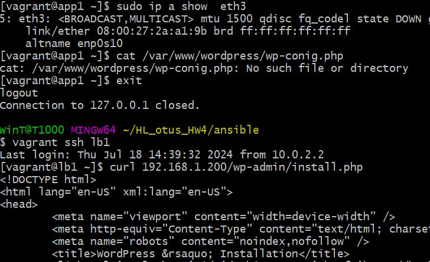

### Выполнение задания по занятию № 9 Альтернативные балансировщики: envoy, traefik
## Задание
terraform (или vagrant) и ansible роль для развертывания серверов веб приложения под высокую нагрузку и отказоустойчивость
в работе должны применяться:
- keepalived, (в случае использовать vagrant и virtualbox), load balancer от yandex в случае использования яндекс клауд  
- nginx,  
- uwsgi/unicorn/php-fpm  
- некластеризованная бд mysql/mongodb/postgres/redis  

Создать несколько инстансов с помощью терраформ (2 nginx, 2 backend, 1 db);  
Развернуть nginx и keepalived на серверах nginx при помощи ansible  
Развернуть бэкенд способный работать по uwsgi/unicorn/php-fpm и базой. (Можно взять что нибудь из Django) при помощи ansible.  
Развернуть gfs2 для бэкенд серверах, для хранения статики  
Развернуть бд для работы бэкенда при помощи ansbile  
Проверить отказоустойчивость системы при выходе из строя серверов backend/nginx  


### Описание выполнения
Задача выполнена на ОС  Almalinux 9.x.  
Для развертывания стенда применяется vagrant.  
Развертывание стенда выполняется командой  
```vagrant up```  
в результате чего будет готов стенд из 5-и виртуальных машин 
- lb1 
- lb2 
- app1
- app2
- db-dss

Роль балансировщиков нагрузки выполнятют lb1 и lb2. App1 и app2 - сервера приложения, на которых запущен wordpress.  
Сервер db-dss выполняет роли сервера базы данных, iscsi-target, а также средство развертывания ПО и конфигуриования
серверов - ansible.
Переменные, которые важно переопределить перед запуском ansible playbook'а:
- в файле roles/fence/vars/main.yml  
**ip_host_os** - ip адрес хоста на котором установлен virtualbox(ip адрес хостовой машины)  
**username_host_os** - login для подключения к хосту на котором установлен virtualbox  
**passwd_username_host_os** - пароль от указанного логина  
**type_host_os** - тип хоста на котором установлен virtualbox, по умолчанию linux. Если хостовой ОС
является windows то при запуске ansible-playbook необходимо переопределить данную переменную
с помощью ключа -e type_host_os=windows. **Для windows не забыть проверить, что ssh запущен, порт 22 открыт**. 
- в файле roles/front/vars/main.yml  
**keepalived_vip**  - виртуальный IP-адрес службы keepalived, для конфигруации балансировщиков.
- в файле roles/vrrp/vars/main.yml  
**interface** - сетевой интерфейс, на который должен присваиваться виртуальный IP адрес  
**virtual_ipaddress** - виртуальный IP-адрес для службы keepalived, на который будут идти запросы  
Для запуска ролей ansible необходимо выполнить следующие действия:  
- подключиться к серверу db-dss  
`vagrant ssh db-dss`
- запустить ansible playbook
```commandline
sudo su - ansible
cd ansible
ansible-playbook playbooks/bootstrap.yml
```
### Результаты тестов
На lb1 останавливаем nginx, виртуальный ip - 192.168.1.200 перешел на lb2.
С lb1 проверяем доступность сайта по виртуальному ip, сайт доступен.  


Запускаем nginx на lb1, видим, что виртуальный ip - 192.168.1.200 вернулся на lb1.  


Останавливаем работу сайта на app1, проверяем доступность сайта с lb1, видим, что сайт отвечает.  


На app1 отключаем сетевой интрефейс eth3, по которому доступна кластерная файлова система GFS2 c  
сервера db-dss и видим, что контент в директории /var/www/wordpress не доступен.  
Проверяем доступность сайта с lb1, видим, что сайт отвечает.  


При обратном влючении сетевого интерфейса eth3, кластерная файлова система становится снова доступна в течении 30-60 сек.

Полезные команды:  
`sudo pcs status --full` # статус кластера  
`sudo pcs stonith config` # gосмотреть настройки stonith, fencing(ограждение)  
`sudo pcs stonith delete  app2_fence` # удалить фенсинг  
`dlm_tool -n ls` # смотреть состояние кластерной ФС GFS2  
`dlm_tool fence_ack <nodeid>` # снять блокировку с ФС GFS2 в следствии сбоя ноды


