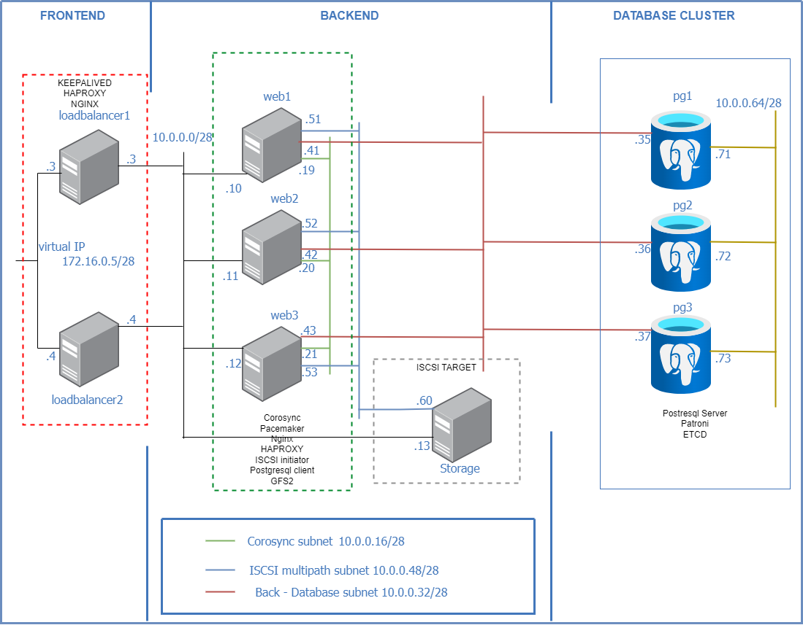

## Высокодоступный веб-портал с кластером базы данных

Проект состоит из:   
- 2-х балансировщиков нагрузки на базе NGINX, работающих в отказоустойчивом режиме;
- 3-x веб серверов на базе NGINX, работающих в кластерном режиме;
- 1-го сервера хранения данных, презентующего lun по iSCSI multipath;
- 3-x серверов баз данных postgresql, работающих в кластерном режиме.  

Все сервера функционируют под управлением ОС Almalinux 9.x, кроме серверов базз данных,
функционирующих под управлением ОС DEBIAN 12.

### Схема проекта  
 

### Описание проекта

**Frontend-сервера:**  
- loadbalancer1
- loadbalancer2  
Рапспределяют запросы по веб-серверам. С помощью keepalived реализован виртуальный ip адрес - 
в случае выхода из строя одного из балансировщиков, запросы направляются на резервный сервер.  

**Backend-сервера:**
- web1
- web2
- web3  
   
Предоставляют веб контент, осуществляют операции записи в базу данных через активную ноду кластера 
баз данных и операции чтения через реплики.   
Состояние веб кластера:  
`sudo pcs status --full`  
```commandline
Cluster name: skynet
Cluster Summary:
  * Stack: corosync (Pacemaker is running)
  * Current DC: web3 (3) (version 2.1.7-5.2.el9_4-0f7f88312) - partition with quorum
  * Last updated: Mon Oct 14 14:56:50 2024 on web1
  * Last change:  Mon Oct 14 14:51:13 2024 by hacluster via hacluster on web3
  * 3 nodes configured
  * 13 resource instances configured

Node List:
  * Node web1 (1): online, feature set 3.19.0
  * Node web2 (2): online, feature set 3.19.0
  * Node web3 (3): online, feature set 3.19.0

Full List of Resources:
  * Clone Set: locking-clone [locking]:
    * Resource Group: locking:0:
      * dlm     (ocf:pacemaker:controld):        Started web1
      * lvmlockd        (ocf:heartbeat:lvmlockd):        Started web1
    * Resource Group: locking:1:
      * dlm     (ocf:pacemaker:controld):        Started web2
      * lvmlockd        (ocf:heartbeat:lvmlockd):        Started web2
    * Resource Group: locking:2:
      * dlm     (ocf:pacemaker:controld):        Started web3
      * lvmlockd        (ocf:heartbeat:lvmlockd):        Started web3
  * Clone Set: shared_vg-clone [shared_vg]:
    * Resource Group: shared_vg:0:
      * sharedlv        (ocf:heartbeat:LVM-activate):    Started web1
      * gfs2    (ocf:heartbeat:Filesystem):      Started web1
    * Resource Group: shared_vg:1:
      * sharedlv        (ocf:heartbeat:LVM-activate):    Started web2
      * gfs2    (ocf:heartbeat:Filesystem):      Started web2
    * Resource Group: shared_vg:2:
      * sharedlv        (ocf:heartbeat:LVM-activate):    Started web3
      * gfs2    (ocf:heartbeat:Filesystem):      Started web3
  * fence-sbd   (stonith:fence_sbd):     Started web1

Migration Summary:

Tickets:

PCSD Status:
  web1: Online
  web2: Online
  web3: Online

Daemon Status:
  corosync: active/enabled
  pacemaker: active/enabled
  pcsd: active/enabled
  sbd: active/enabled
```
**Сервер хранения данных:**
- storage  
Предоставляет LUN для веб серверов, на котром хранится веб контент сайта.

**Кластер баз данных:**
- pg1
- pg2
- pg3  
Сервера объединены в кластер с использованием patroni и etcd. Одна нода главная и две реплики.  

Состояние кластера:  
`ENDPOINTS=$(etcdctl member list | grep -o '[^ ]\+:2379' | paste -s -d,)`  
`etcdctl endpoint status --endpoints=$ENDPOINTS -w table` 
```commandline
+-----------------------+------------------+---------+---------+-----------+------------+-----------+------------+--------------------+--------+
|       ENDPOINT        |        ID        | VERSION | DB SIZE | IS LEADER | IS LEARNER | RAFT TERM | RAFT INDEX | RAFT APPLIED INDEX | ERRORS |
+-----------------------+------------------+---------+---------+-----------+------------+-----------+------------+--------------------+--------+
| http://10.0.0.73:2379 | 8d968f7a86ad295c |  3.4.23 |   20 kB |     false |      false |         2 |        363 |                363 |        |
| http://10.0.0.72:2379 | a681c6688cac9f8f |  3.4.23 |   20 kB |      true |      false |         2 |        363 |                363 |        |
| http://10.0.0.71:2379 | c5ed78b879d8c762 |  3.4.23 |   20 kB |     false |      false |         2 |        363 |                363 |        |
+-----------------------+------------------+---------+---------+-----------+------------+-----------+------------+--------------------+--------+
```
`patronictl -c /etc/patroni/config.yml list`
```commandline
+ Cluster: pg-cluster-skynet (7425645227224403947) ---------+-----------------+
| Member | Host      | Role    | State     | TL | Lag in MB | Tags            |
+--------+-----------+---------+-----------+----+-----------+-----------------+
| etcd1  | 10.0.0.35 | Leader  | running   |  1 |           | clonfrom: false |
| etcd2  | 10.0.0.36 | Replica | streaming |  1 |         0 | clonfrom: false |
| etcd3  | 10.0.0.37 | Replica | streaming |  1 |         0 | clonfrom: false |
+--------+-----------+---------+-----------+----+-----------+-----------------+
```

